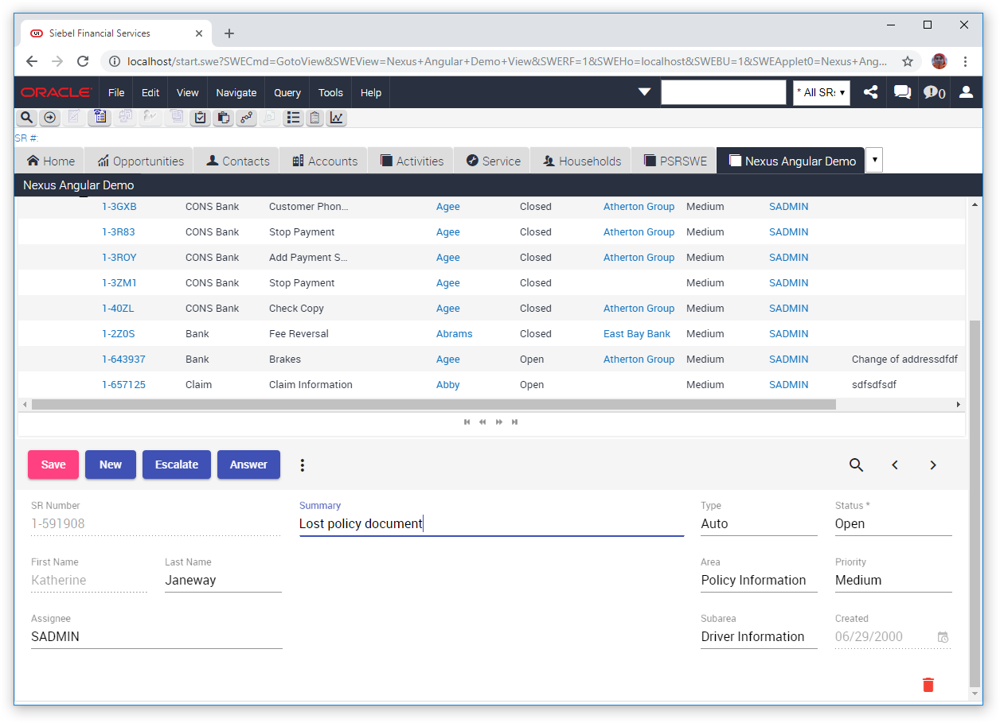

# Quick Start Guide: Nexus19 + Angular example

This guide will help to setup Nexus19 with the demo of a Form Applet that is built using Nexus19 and Angular framework.
 The applet supports:
- navigation through records
- displaying, editing, saving and deleting data
- picklists that are read from Siebel configuration
- field properties that are read from Siebel configuration (required, readonly)
- query operations

This is not an example of implementation that can be used on production. It is intentionally kept straightforward.
The demo example was tested with 16.0 ENU.

1. Make a clean [Nexus19 Setup](/../wikis/Setup Nexus19) if you haven't done it before.
1. Import SIF files in `siebel/sif/*` into the Siebel Tools.
1. Add the `Nexus Angular Demo Screen` to your application:
      * Findout your Siebel Application Name in application `.cfg` file or by logging in and typing `SiebelApp.S_App.GetAppName()` in Chrome Developer Tools console.
      * Use Siebel Tools and add `Nexus Angular Demo Screen` under `Application > Screen Menu Item` for your Siebel Application Name
      * Also add `Nexus Angular Demo Screen`(with `Nexus Angular Demo` value for `Text - String Override` property) under `Application > Page Tab` for your Siebel Application Name
1. Add the `Nexus Angular Demo View` to your application:
      * Use Siebel Client to add a new record with Name `Nexus Angular Demo View` under `Administration - Application > Views`
      * Under `Administration - Application > Views` add any Responsibility to this View
      * Under `Administration - User > Users` – add same Responsibility to your User
      * Click `Clear cache` button under `Administration – Application > Responsibilities` view
1. Compile (Siebel IP16 and earlier) or Submit (Siebel IP17+) following objects: 
    * `Nexus Angular Demo` project
    * Application object, that you've updated above.
1. Re-login to your Siebel Application and check that the `Nexus Angular Demo` screen is available.
1. Copy below files to the `[CLIENT_HOME or SERVER_HOME]/public/SCRIPTS/siebel/custom/` folder:
    * `dist/*.*` excluding `font` folder.
1. Copy below files to the `[CLIENT_HOME or SERVER_HOME]/public/fonts/` folder:
    * `dist/fonts/*.*`.
1. Use Siebel Client to reference js files in Siebel Open UI Manifest as follows:
	- under `Administration - Application > Manifest Files` 
	>- add a new record with: 
	> **Name:** `siebel/custom/SRFormPR.js`

	- under `Administration - Application > Manifest Administration` 

   >- add a new record under **UI Objects** with: 
   >     **Name:** `Nexus Angular Demo Form Applet`
   >     **Usage Type:** `Physical Renderer`
   >     **Type:** `Applet`

   >- add a new record under **Object Expression** with:
   >     **Level:** `1`

   >- add a new record under **Files** with:
   > **Name:** `siebel/custom/SRFormPR.js`

1. Empty browser cache and hard reload
    *(e.g. using Chrome: press F12, then right-click a browser Refresh button and press ‘Empty Cache and Hard Reload’)*
1. Re-login to your Siebel Application.
1. Navigate to the `Nexus Angular Demo` Screen.