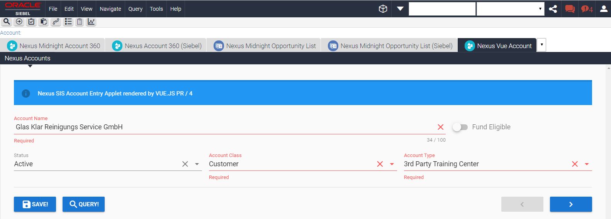

# Quick Start Guide: Nexus19 + Vue.js example

This guide will help to setup Nexus19 with the demo of a Form Applet that is built using Nexus19 and Vue.js
 The applet supports:
- navigation through records
- displaying, editing and saving data
- picklists that are read from Siebel configuration
- field properties that are read from Siebel configuration (required, field length)

This is not an example of implementation that can be used on production. It is intentionally kept straightforward and inlined to make sure that demo works almost everywhere and also with IE11 without bundling. 
The demo example was tested with 16.19 ENU.

 

1. Make a clean [Nexus19 Setup](/../wikis/Setup Nexus19) if you haven't done it before.
1. Import the `n19helper-master/examples/VUE.JS Examples/Demo Example/SIF` sif-files into the Siebel Tools.
1. Add the `N19 Account View` to your application: 
      * Choose a Screen that you have available in your Siebel application e.g. `Accounts Screen`
      * Add `N19 Account View` to this screen using Siebel Tools(`Screen > Screen view`)
      * Use Siebel Client to add a new record with Name `N19 Account View` under `Administration - Application > Views`
      * Under `Administration - Application > Views` add any Responsibility to this View
      * Under `Administration - User > Users` – add same Responsibility to your User
      * Click `Clear cache` button under `Administration – Application > Responsibilities` view
1. Compile(Siebel IP16 and earlier) or Submit(Siebel IP17+) following objects: 
    * `Nexus19 Demo Examples` project
    * Screen that you've updated above.
1. Re-login to your Siebel Application and check that the view is available visible under the screen you've added it to.
1. Copy below files to the `[Siebel Client or Server Home]\public\SCRIPTS\siebel\custom\` folder:
    * `n19helper-master\examples\VUE.JS Examples\*.js`
    * `n19helper-master\examples\VUE.JS Examples\Demo Example\N19_vuedemo_PR.js`
1. Copy `n19helper-master\examples\VUE.JS Examples\vuetify.min.css` file to the `[Siebel Client or Server Home]\public\files\custom` folder.
1. Use Siebel Client to reference js files in Siebel Open UI Manifest as follows:
	- under `Administration - Application > Manifest Files` 
	>- add a new record with: 
	> **Name:** `siebel/custom/N19_vuedemo_PR.js`

	- under `Administration - Application > Manifest Administration` 

   >- add a new record under **UI Objects** with: 
   >     **Name:** `N19 SIS Account Entry Applet`
   >     **Usage Type:** `Physical Renderer`
   >     **Type:** `Applet`

   >- add a new record under **Object Expression** with:
   >     **Level:** `1`

   >- add a new record under **Files** with:
   >     **Name:** `siebel/custom/N19_vuedemo_PR.js`

1. Re-login to your Siebel Application.
1. Empty browser cache and hard reload
    (e.g. using Chrome: press F12, then right-click a browser Refresh button and press ‘Empty Cache and Hard Reload’)
1. Navigate to the `N19 Account View`.
